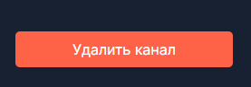

# Отчет о тестировании веб-мессенджера ["Патефон"](https://patefon.site/)
Данные для входа на сервис:
- Почта: user11
- Пароль: 12345678

## Сессия тестирования 22.02.2025 22:04

### Общие данные

- Место проведения тестирования: Google Chrome Версия 128.0.6613.84 (Официальная сборка), (64 бит)
- Продолжительность тестирования: 0:05

### 1. Информация о канале
#### 1.1. Контейнер "вложения"
**В контейнере содержатся информация о фото и файлах, отправленных в текущем чате**

1. Клик по кнопке "Фото" при открытом списке файлов открывает список фото 
2. Клик по кнопке "Фото" при открытом списке фото открывает ничего не меняет
#### 1.2. Контейнер "управление чатом"
**В контейнере содержится основная информация о чате и интерфейс упраления им**

1. Клик на кнопку "выйти из канала" убирает чат из списка чатов и возвращает нас на главную страницу

    

### 1. Сайдбар
#### 1.1. Контейнер "кнопки навигации"
**В контейнере содержатся кнопки для навигации по сайту и иконка профиля пользователя**

1. При наведении на кнопку "Домой" ее фон подсвечивается

    

2. Клик на кнопку "Домой" открывает список чатов
3. При наведении на кнопку "Контакты" ее фон подсвечивается

    

4. Клик на кнопку "Контакты" открывает список контактов
5. При наведении на кнопку "Настройки" ее фон подсвечивается

    

6. Клик на кнопку "Настройки" открывает профиль

7. Клик на автарку профиля пользователя открывает профиль

### Заключение

При тестировании не было обнаружено багов. 

### Подпись: [Владимир Светлаков](https://github.com/vovasvl)

## Сессия тестирования 02.03.2025 20:18

### Общие данные

- Место проведения тестирования: Google Chrome Версия 128.0.6613.84 (Официальная сборка), (64 бит)
- Продолжительность тестирования: 2:20

### 1. Профиль пользователя
**В профиле расположены имя профиля, его аватар, дата регистрации и описание**

#### 1.1 Поле редактирования аватара

1. Клик на иконку аватара открывает проводник ОС с фильтром расширений `webp`, `gif`, `jfif`, `pjpeg`, `jpeg`, `pjp`, `jpg`, `png`

    

    

2. При выборе изображения аватар в интерфейсе меняется на выбронную картинку

    

3. Нажатие на кнопку "Подтвердить изменения" выводит ошибку в поле "дата рождения"

    - Баг: нельзя поменять информацию о пользователе пока не заполнено поле "дата рождения"

    

4. Нажатие на кнопку "Подтвердить изменения" отправляет на главную страницу, новый аватар отображается в миниатюре профиля слева снизу

    

##### 1.1.1 Загрузка разных типов файлов в поле "аватар" 

1. Выбор файла `webp` в качестве аватара - нет ошибок

    

2. Выбор файла `jpeg` в качестве аватара - нет ошибок

    

3. Выбор файла `png` в качестве аватара - нет ошибок

    

4. Выбор файла `gif` в качестве аватара - нет ошибок

    

5. Выбор файла `jpg` в качестве аватара - нет ошибок

    

6. Выбор файла `pdf` в качестве аватара - ошибка

    

7. Выбор файла `zip` в качестве аватара - ошибка

    

8. Выбор файла размером 1 Гб в качестве аватара - ошибка

    - Баг: текст ошибки смещен влево

    

#### 1.2 Поле редактирования даты рождения

1. Клик по кнопке "календарь" открывает меню с выбором даты

    

2. Клик по дате вставляет ее в поле "дата рождения"

    

3. Клик по числу внутри поля "дата рождения" позволяет ввести число в ручном режиме

    

4. Ввод 1000 года рождение в поле "дата рождения" - ошибка

    

5. Ввод 2026 года  в поле "дата рождения" - ошибка

    

6. Ввод 31 фераля в поле "дата рождения" - ошибка

    

#### 1.3 Поле редактирования описания профиля

1. Ввод латинских символов в поле "описание профиля" - ошибок нет

    

2. Ввод кириллических символов в поле "описание профиля" - ошибок нет

    

3. Ввод цифр в поле "описание профиля" - ошибок нет

    

4. Ввод набора символов `<>"{}()~*&^%$#@?!'_-+=:;.,/\|` в поле "описание профиля" - ошибок нет

    - Баг: неккоректное отображение спецсимволов `<`, `>`, `"`, `&`, `'`

    

5. Ввод смайликов Unicode в поле "описание профиля" - ошибок нет

    

6. Ввод 3000 символ в поле "описание профиля" - ошибок нет

    

6. Ввод 10000 слов в поле "описание профиля" - ошибок нет

    

6. Ввод 100000 слов в поле "описание профиля" - ошибок нет, поле пустое

    

    - Баг: нет ограничение на количество символов в поле "описания профиля", можно выставить 100000 слов, из-за чего при загрузке отображения поля сайт выдает ошибку 

        

#### 1.4 Кнопка "выход из аккаунта"

1. При клике на кнопку происходит выход из аккаунта

    

### Заключение

При тестировании были выявлены визуальные баги и баги среднего приоритета. Общее состояние и функциональность страницы объявления можно оценить как хорошее.

### Подпись: [Дмитрий Селянинов](https://github.com/nonrep)