# Отчет о тестировании веб-мессенджера ["Патефон"](https://patefon.site/)

Данные для входа на сервис:

- Почта: user11
- Пароль: 12345678

## Сессия тестирования 22.02.2025 22:04

### Общие данные

- Место проведения тестирования: Google Chrome Версия 133.0.6943.143 (Официальная сборка), (64 бит)
- Продолжительность тестирования: 3:15

### 1. Страница регистрации и авторизации

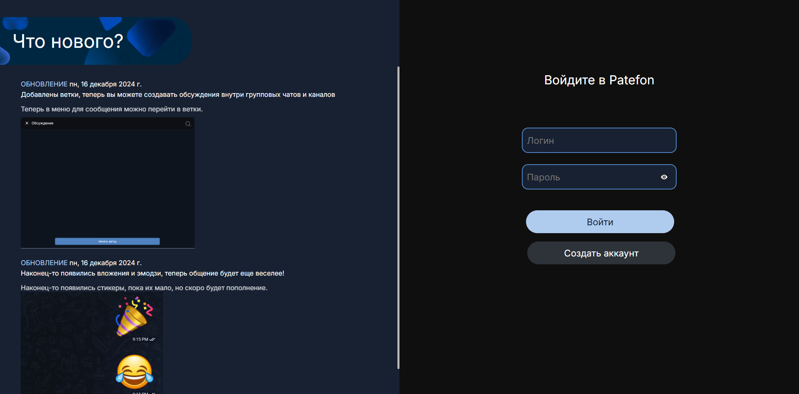

#### 1.1. Контейнер "Что нового?"

**В контейнере содержится информация об обновлениях приложения**

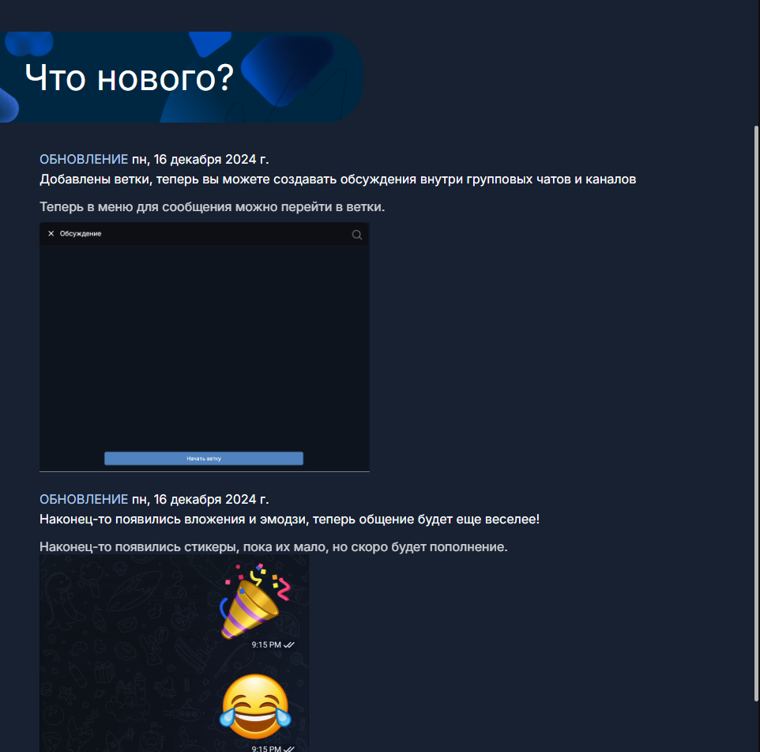

1. Скролл вниз пролистывает список обновлений до конца
2. Скролл вверх пролистывает список обновлений до конца

#### 1.2. Контейнер "форма авторизации"

**В контейнере содержится форма для входа в приложение и кнопка перехода в форму регистрации**

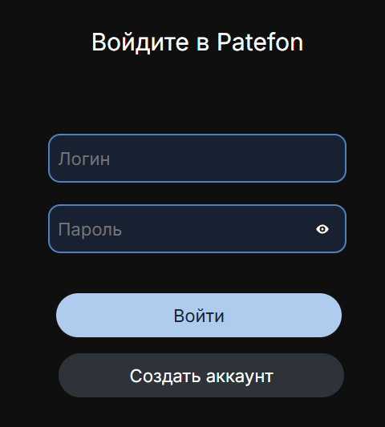

1. При вводе данных от существующего аккаунта происходит успешный вход в аккаунт и открывается главная страница приложения
2. При попытке входа без ввода логина и пароя появляется ошибка

   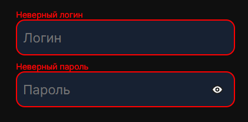

3. При вводе данных от несуществующего аккаунта появляется ошибка

   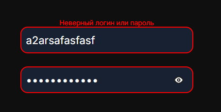

   - Баг: текст ошибки отцентрован

4. При вводе существующего логина и некорректного пароля появляется ошибка

   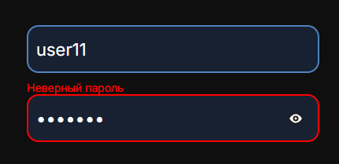

5. Клик на иконку "глаз" показывает пароль

   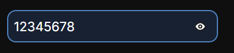

6. Повторный клик на иконку "глаз" скрывает пароль

   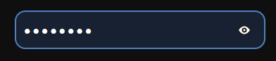

7. При нажатии клавиши "Enter" происходит попытка входа
8. При клике на кнопку "Войти" происходит попытка входа

   

9. При клике на кнопку "Создать аккаунт" происходит переход на форму регистрации

   

#### 1.3. Контейнер "форма регистрации"

**В контейнере содержится форма для создания аккаунта и кнопка перехода в форму авторизации**

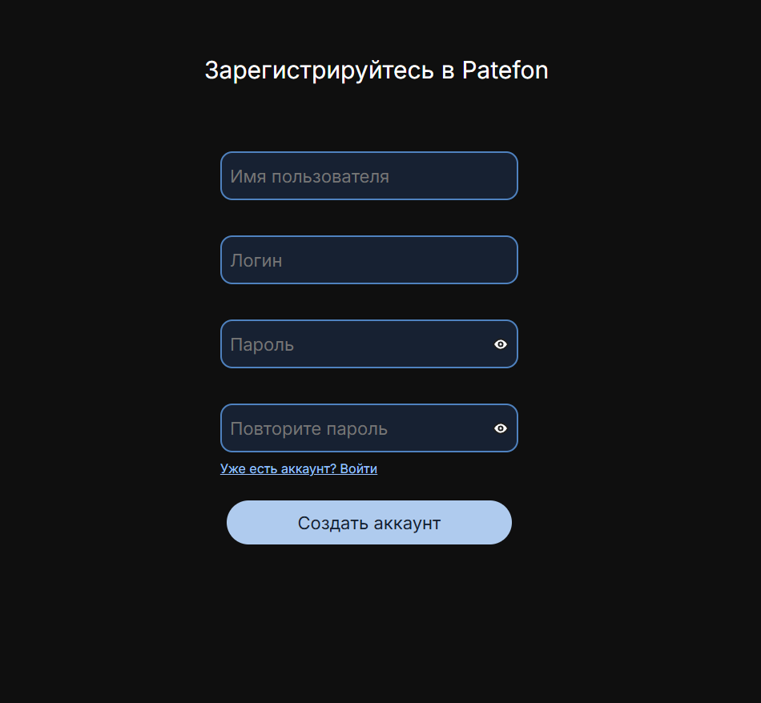

1. При вводе валидных данных происходит успешная регистрация
2. При вводе невалидного имени пользователя появляется ошибка

   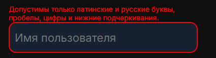

3. При вводе невалидного логина появляется ошибка

   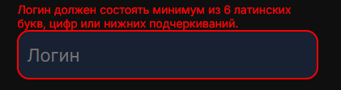

4. При вводе невалидного пароля появляется ошибка

   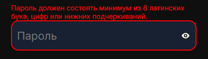

5. При вводе несовпадающих паролей, появляется ошибка

   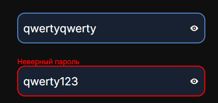

6. При вводе данных существущего пользователя, появляется ошибка

   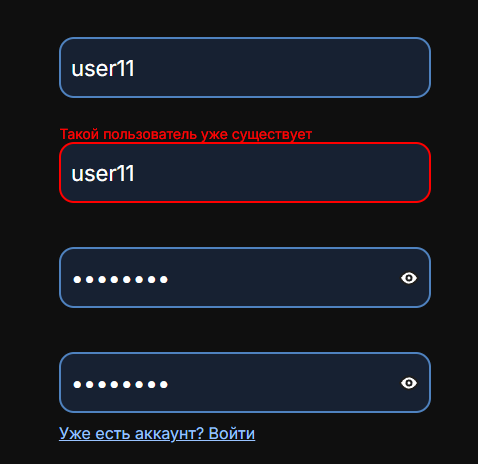

7. При нажатии клавиши "Enter" происходит попытка регистрации
8. При клике на кнопку "Создать аккаунт" происходит попытка регистрации

   

9. При клике на кнопку "Уже есть аккаунт? Войти" происходит переход на форму авторизации

   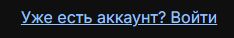

### 2. Сайдбар

#### 2.1. Контейнер "кнопки навигации"

**В контейнере содержатся кнопки для навигации по сайту и иконка профиля пользователя**

1. При наведении на кнопку "Домой" ее фон подсвечивается

   

2. Клик на кнопку "Домой" открывает список чатов
3. При наведении на кнопку "Контакты" ее фон подсвечивается

   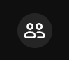

4. Клик на кнопку "Контакты" открывает список контактов
5. При наведении на кнопку "Настройки" ее фон подсвечивается

   

6. Клик на кнопку "Настройки" открывает профиль

7. Клик на автарку профиля пользователя открывает профиль

### 3. Информация о чате (общие тесты для всех типов чата)

#### 3.1. Контейнер "основная информация"

**В контейнере содержится информация о данном чате**

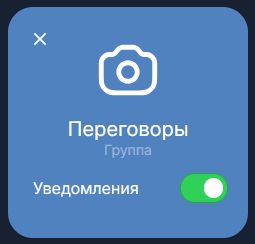

1. Клик по кнопке "X" закрывает вкладку с информацией о чате

2. Клик по кнопке изменения чата открывает вкладку с формой для изменения чата (кнопка отображается только для создателя чата)

   

3. Проверено, что фотография чата отображается корректно
4. Проверено, что название чата отображается корректно
5. Проверено, что тип чата отображается корректно
6. При включенных уведомлениях приходят оповещения о новых сообщениях
   

   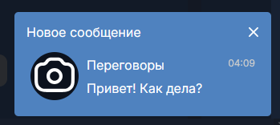

7. При выключенных уведомлениях оповещения о новых сообщениях не приходят

   

#### 3.2. Контейнер "изменение чата"

**В контейнере содержится форма для изменения чата**

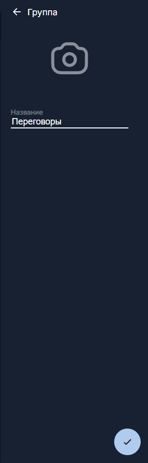

1. Клик по кнопке "назад" возвращает пользователя на вкладку с информацией о чате

   

2. Клик по фотографии позволяет загрузить новую аватарку чата

   

   - Баг: при выборе фотографии некорректного формата (pdf) изменение чата не завершается, но и никакой ошибки не выводится

   

3. При вводе пустого названия чата, появится ошибка

   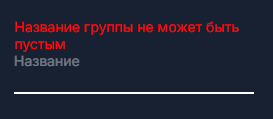

4. При вводе названия чата больше 20 символов, появится ошибка

   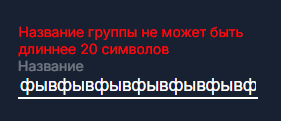

5. Клик по кнопке "отправить" при корректных введенных данных завершает изменение чата и закрывает вкладку

   

#### 3.3. Контейнер "вложения"

**В контейнере содержится информация о фото и файлах, отправленных в текущем чате**

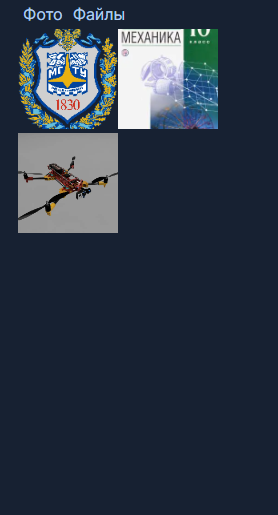

1. Клик по кнопке "Фото" при открытом списке файлов открывает список отправленных фото

   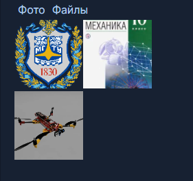

2. Клик по карточке фото начинает его загрузку

   

   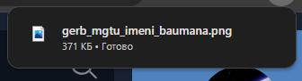

3. Клик по кнопке "Файлы" при открытом списке файлов открывает список отправленных файлов

   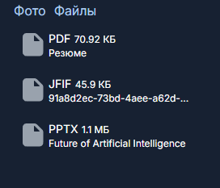

4. Клик по карточке файла начинает его загрузку

   

   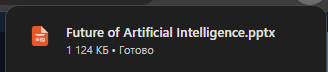

### 4. Информация о личном чате

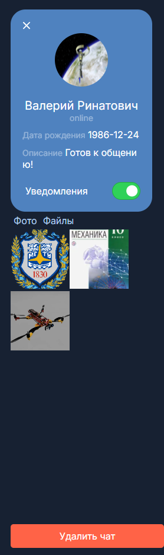

#### 4.1. Контейнер "основная информация"

**В контейнере содержится информация о личном чате**

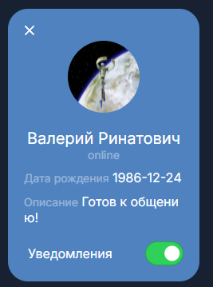

1. Отображается дата рождения пользователя
2. Отображается описание профиля пользователя

#### 4.2. Контейнер "управление чатом"

**В контейнере содержится интерфейс управления личным чатом**

1. Клик на кнопку "удалить чат" убирает чат из списка чатов и возвращает пользователя на главную страницу

   

   - Баг: справа от кнопки нет отступа

### 4. Информация о группе

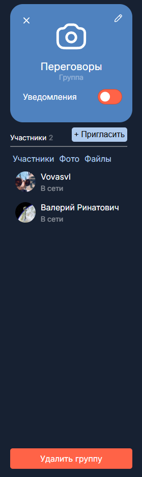

#### 4.1. Контейнер "участники"

**В контейнере содержится информация о количестве участников в группе и кнопка добавления новых участников**

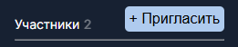

1. Клик по кнопке "Пригласить" открывает окно выбора контакта

   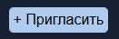

   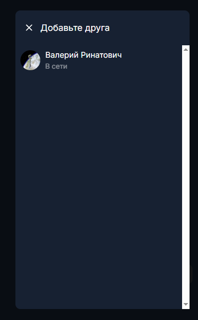

2. Клик по кнопке "X" закрывает окно

   

3. Клик по карточке контакта добавляет нового учатника в группу

   

   - Баг: участники, которые уже находятся в группе, тоже доступны для приглашения в группу

#### 4.2. Контейнер "участники и вложения"

**В контейнере содержится информация об участниках, фото и файлах, отправленных в текущем чате**

1. Клик на кнопку "Участники" открывает список участников группы

#### 4.3. Контейнер "управление группой"

**В контейнере содержится интерфейс управления группой**

1. Клик на кнопку "Удалить канал" убирает канал из списка чатов у всех его участников и возвращает пользователя на главную страницу (отображается только у создателя канала)

   

### 5. Информация о канале

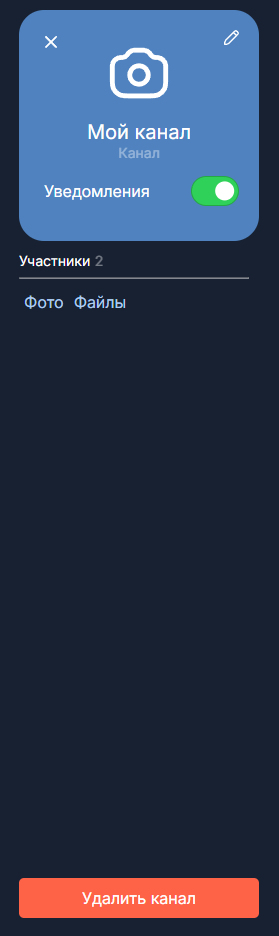

#### 5.1. Контейнер "управление чатом"

**В контейнере содержится интерфейс управления чатом**

1. **Клик на кнопку "Выйти из группы"**

   - Проверено, что группа удаляется из списка чатов у вышедшего пользователя.
   - Проверено, что вышедший пользователь перенаправляется на главную страницу.
   - Проверено, что у вышедшего пользователя больше нет доступа к группе (если перейти по URL чата, то открывается пустая главная страница).
   - Проверено, что список участников группы обновляется у всех пользователей.

   

2. Клик на кнопку "Удалить группу" убирает группу из списка чатов у всех его участников и возвращает пользователя на главную страницу (отображается только у создателя группы)

### Заключение

При тестировании были выявлены визуальные баги и баги среднего приоритета. Общее состояние и функциональность страницы можно оценить как хорошее.

### Подпись: [Владимир Светлаков](https://github.com/vovasvl)

## Сессия тестирования 02.03.2025 20:18

### Общие данные

- Место проведения тестирования: Google Chrome Версия 128.0.6613.84 (Официальная сборка), (64 бит)
- Продолжительность тестирования: 2:20

### 1. Профиль пользователя

**В профиле расположены имя профиля, его аватар, дата регистрации и описание**

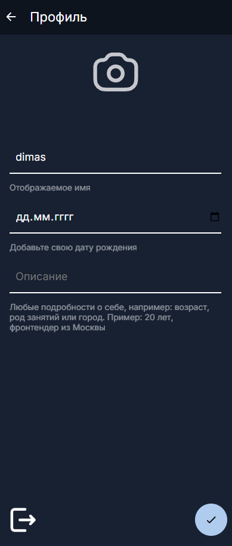

#### 1.1 Поле редактирования аватара

1. Клик на иконку аватара открывает проводник ОС с фильтром расширений `webp`, `gif`, `jfif`, `pjpeg`, `jpeg`, `pjp`, `jpg`, `png`

   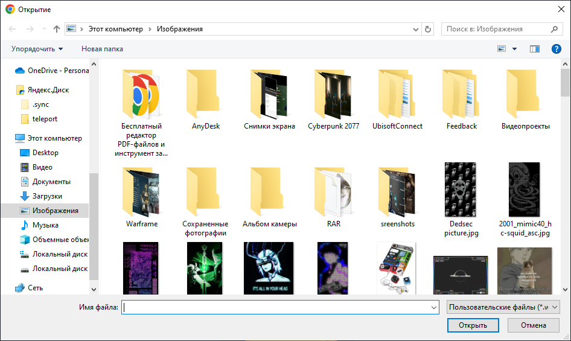

   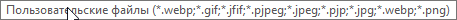

2. При выборе изображения аватар в интерфейсе меняется на выбронную картинку

   

3. Нажатие на кнопку "Подтвердить изменения" выводит ошибку в поле "дата рождения"

   - Баг: нельзя поменять информацию о пользователе пока не заполнено поле "дата рождения"

   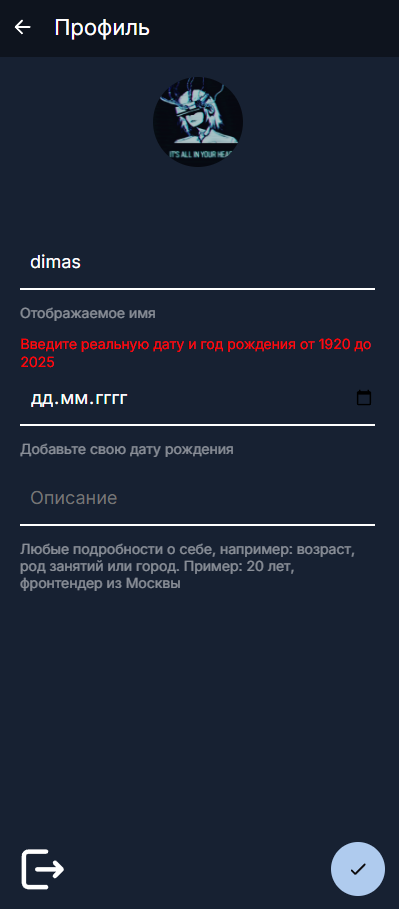

4. Нажатие на кнопку "Подтвердить изменения" отправляет на главную страницу, новый аватар отображается в миниатюре профиля слева снизу

   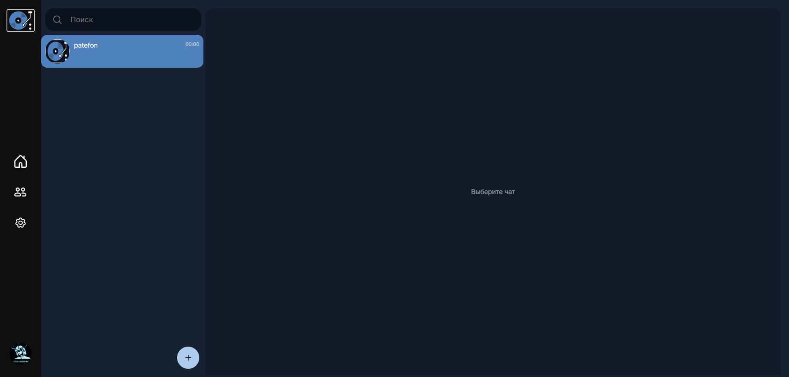

##### 1.1.1 Загрузка разных типов файлов в поле "аватар"

1. Выбор файла `webp` в качестве аватара - нет ошибок

   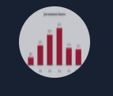

2. Выбор файла `jpeg` в качестве аватара - нет ошибок

   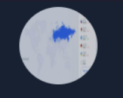

3. Выбор файла `png` в качестве аватара - нет ошибок

   

4. Выбор файла `gif` в качестве аватара - нет ошибок

   

5. Выбор файла `jpg` в качестве аватара - нет ошибок

   

6. Выбор файла `pdf` в качестве аватара - ошибка

   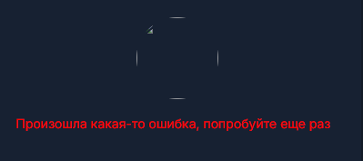

7. Выбор файла `zip` в качестве аватара - ошибка

   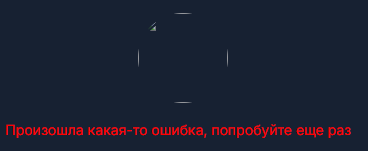

8. Выбор файла размером 1 Гб в качестве аватара - ошибка

   - Баг: текст ошибки смещен влево

   

#### 1.2 Поле редактирования даты рождения

1. Клик по кнопке "календарь" открывает меню с выбором даты

   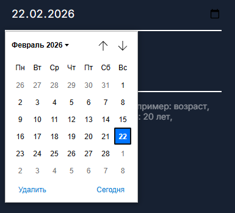

2. Клик по дате вставляет ее в поле "дата рождения"

   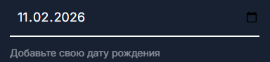

3. Клик по числу внутри поля "дата рождения" позволяет ввести число в ручном режиме

   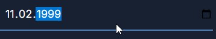

4. Ввод 1000 года рождение в поле "дата рождения" - ошибка

   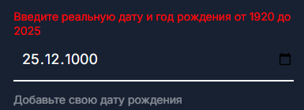

5. Ввод 2026 года в поле "дата рождения" - ошибка

   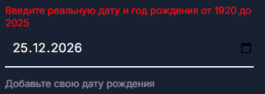

6. Ввод 31 фераля в поле "дата рождения" - ошибка

   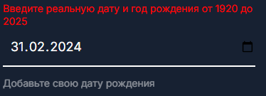

#### 1.3 Поле редактирования описания профиля

1. Ввод латинских символов в поле "описание профиля" - ошибок нет

   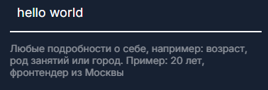

2. Ввод кириллических символов в поле "описание профиля" - ошибок нет

   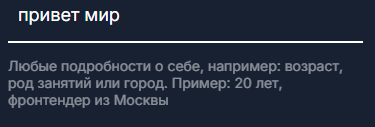

3. Ввод цифр в поле "описание профиля" - ошибок нет

   

4. Ввод набора символов `<>"{}()~*&^%$#@?!'_-+=:;.,/\|` в поле "описание профиля" - ошибок нет

   - Баг: неккоректное отображение спецсимволов `<`, `>`, `"`, `&`, `'`

   

5. Ввод смайликов Unicode в поле "описание профиля" - ошибок нет

   

6. Ввод 3000 символ в поле "описание профиля" - ошибок нет

   

7. Ввод 10000 слов в поле "описание профиля" - ошибок нет

   

8. Ввод 100000 слов в поле "описание профиля" - ошибок нет, поле пустое

   

   - Баг: нет ограничение на количество символов в поле "описания профиля", можно выставить 100000 слов, из-за чего при загрузке отображения поля сайт выдает ошибку

     

#### 1.4 Кнопка "выход из аккаунта"

1. При клике на кнопку происходит выход из аккаунта

   

### Заключение

При тестировании были выявлены визуальные баги и баги среднего приоритета. Общее состояние и функциональность страницы можно оценить как хорошее.

### Подпись: [Дмитрий Селянинов](https://github.com/nonrep)

## Сессия тестирования 08.03.2025 22:13

### Общие данные

- Место проведения тестирования: Google Chrome Версия 128.0.6613.84 (Официальная сборка), (64 бит)
- Продолжительность тестирования: 2:09

### 1. Контакты

- Баг: между хедером и инпутом "поиск" нет отступа

#### 1.1 Контейнер "контакты"

**В контейнере находится список пользователей, которые являются контактами**

1. При наведении на карточку контакта ее фон подсвечивается

   

2. При нажатии на карточку контакта перекидывает на основной виджет с открытым чатом

   

#### 1.2 Инпут "поиск"

**Инпут используется для поиска пользователей по отображаемому имени или никнейму среди контактов и глобальных пользоветелей**

1. Нажатие на инпут открывает историю запросов

   

2. Каждый ввод символа запускает поиск

   

3. Клик по карточке пользователя перекидывает на основной виджет с открытым чатом

   

4. Пользователи не отображаются, если совпадений нет

   

#### 1.3 Кнопка "добавить контакт"

1. Клик по кнопке открывает контейнер с инпутом никнейма пользователя

   

2. Клик по инпуту открывает историю запросов

   

3. Ввод неверного никнейма приводит к ошибке

   

4. Попытка добавить самого себя приводит к ошибке

   

5. Попытка добавить пользователя, который уже находится в контактах, приводит к ошибке

   

6. При отправке пустого ввода появляется ошибка

   

   - Баг: Запрос с пустым вводом отправляется на сервер, а не валидируется на фронте

7. После ввода никнейма существующего пользователя, он добавился в список контактов

   

### 2. Основной виджет

#### 2.1 Контейнер "список чатов"

**Контейнер содержит чаты пользователя**

1. При наведении на карточку чата она подсвечивается

   

2. Клик на чат открывает его и подсвечивает в списке чатов

   

3. При добавлении количества чатов, при котором они не помещаются в контейнер, появляется скроллер

   

#### 2.2 Инпут "поиск чатов"

**Инпут используется для поиска чатов по их названию среди чатов пользователя и глобальных каналов**

1. Каждый ввод символа запускает поиск чатов, отображаются чаты пользователя и глобальные каналы

   

2. При наведении на чат, он подсвечивается

   

3. При нажатии на чат, открывается его содержимое; в списке чатов он подсвечивается

   

   - Баг: При клике на чат пользователя, он не подсвечивается

     

4. Чаты не отображаются, если совпадений нет

   

#### 2.3 Контейнер "создание чата"

**Контейнер содержит 3 кнопки: создания личного чата, группы и канала**

##### 2.3.1 Кнопка "создать личный чат"

1. Нажатие на кнопку "создать личный чат" открывает список контактов

   

2. Нажатие на пользователя создает личный чат, если он еще не создан, иначе просто открывает существующий чат

   

##### 2.3.2 Кнопка "создать группу"

1. Клик на кнопку открывает форму создания группы с инпутом загрузки аватара, инпутом названия чата и списком контактов в виде чекбоксов

   

###### 2.3.2.1 Инпут аватарки

1. Клик по иконки аватарки открывает проводник ОС с фильтром расширений webp, gif, jfif, pjpeg, jpeg, pjp, jpg, png

   

2. При выборе изображения аватар в интерфейсе меняется на выбранную картинку

   

3. Выбор файла `webp` в качестве аватара - нет ошибок

   

4. Выбор файла `jpeg` в качестве аватара - нет ошибок

   

5. Выбор файла `png` в качестве аватара - нет ошибок

   

6. Выбор файла `gif` в качестве аватара - нет ошибок

   

7. Выбор файла `jpg` в качестве аватара - нет ошибок

   

8. Выбор файла `pdf` в качестве аватара - ошибка

   

9. Выбор файла `zip` в качестве аватара - ошибка

   

###### 2.3.2.2 Инпут названия группы

1. При пустом вводе появляется ошибка

   

   - Баг: Выдается не конкретная ошибка о требовании к длине названия

2. Ввод латинских символов - ошибок нет
3. Ввод кириллических символов - ошибок нет
4. Ввод цифр - ошибок нет
5. Ввод набора символов <>"{}()~\*&^%$#@?!'\_-+=:;.,/\| - ошибка

   

   - Баг: Выдается не конкретная ошибка о допустимых сивмолах

6. Ввод смайликов Unicode - ошибка

   

7. Ввод 20 символов - ошибок нет

8. Ввод 21 символа - ошибка

   

   - Баг: Выдается не конкретная ошибка о лимите в 20 символов в названии

###### 2.3.2.3 Чекбоксы с контактами

1. Создание чата без выбора участиков - ошибка

   

2. Создание чата с одним выбранным пользователем - ошибок нет

   

3. Создание чата со всеми доступными пользователями (4) - ошибок нет

   

4. Если у пользователя нет контактов, он не может создать группу, т.к. он не может выбрать участников

   

   - Баг: Пользователь без контактов может попасть в форму создания группы, но у него не получится успешно создать группу из-за отсутствия контактов

##### 2.3.3 Кнопка "создать канал"

1. Клик на кнопку открывает форму создания канала с инпутом загрузки аватара и инпутом названия чата

   

2. При создании канала происходит редирект в список чатов с открытым созданным каналом

   

   

###### 2.3.3.1 Инпут аватарки

1. Клик по иконки аватарки открывает проводник ОС с фильтром расширений webp, gif, jfif, pjpeg, jpeg, pjp, jpg, png

   

2. При выборе изображения аватар в интерфейсе меняется на выбранную картинку

   

3. Выбор файла `webp` в качестве аватара - нет ошибок

   

4. Выбор файла `jpeg` в качестве аватара - нет ошибок

   

5. Выбор файла `png` в качестве аватара - нет ошибок

   

6. Выбор файла `gif` в качестве аватара - нет ошибок

   

7. Выбор файла `jpg` в качестве аватара - нет ошибок

   

8. Выбор файла `pdf` в качестве аватара - ошибка

   

9. Выбор файла `zip` в качестве аватара - ошибка

   

###### 2.3.3.2 Инпут названия канала

1. При пустом вводе появляется ошибка

   

2. Ввод латинских символов - ошибок нет
3. Ввод кириллических символов - ошибок нет
4. Ввод цифр - ошибок нет
5. Ввод набора символов <>"{}()~\*&^%$#@?!'\_-+=:;.,/\| - ошибка

   

6. Ввод смайликов Unicode - ошибка

   

7. Ввод 20 символов - ошибок нет

8. Ввод 21 символа - ошибка

   

   - Баг: Неверный текст ошибки, название из 20 символов считается валидным

### Заключение

При тестировании были выявлены визуальные баги и баги среднего приоритета. Общее состояние и функциональность страницы можно оценить как хорошее.

### Подпись: [Дмитрий Селянинов](https://github.com/nonrep)
